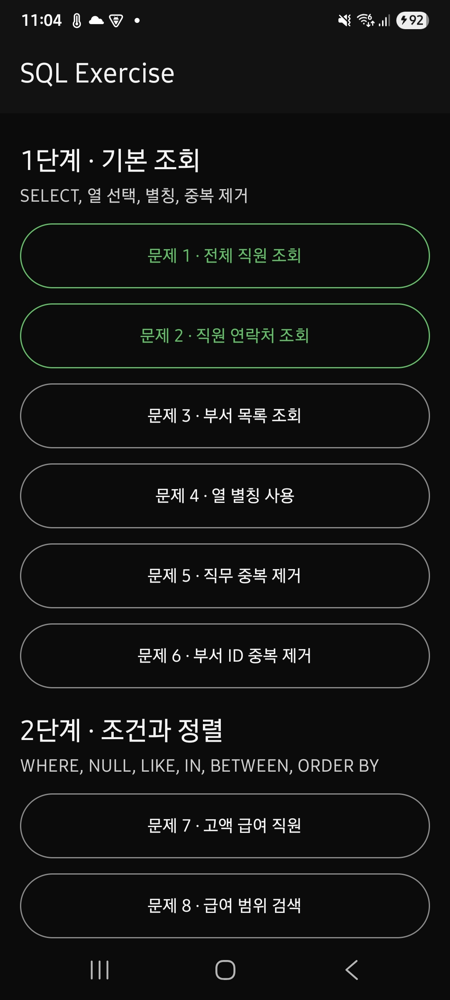
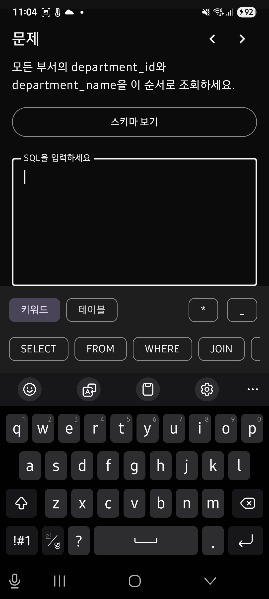

# SQL Exercise

SQL 문제를 레벨별로 풀어볼 수 있는 Kotlin Android 앱입니다. Jetpack Compose와 Material 3로 UI를 구성하고 Navigation Compose로 목록과 상세 화면을 연결합니다.

## 앱 화면

| 레벨 목록 | 문제 상세 |
| --- | --- |
|  |  |

## 현재 기능

- 기초 조회부터 고급 분석까지 8단계, 70개 SQL 문제 제공
- 단계별 학습 목표와 문제 목록 제공
- 전체 너비의 outlined 버튼을 통한 문제 상세 화면 이동
- 상세 화면에서 이전·다음 문제로 바로 이동
- 레벨별 SQL 문제와 정답 샘플 데이터 제공
- 여러 줄 SQL 입력, 초기화, 제출 기능
- 소프트 키보드 표시 중 SQL 키워드, 테이블명, `*`, `_` 입력 보조 칩 제공
- 문제 화면에서 접어서 확인할 수 있는 HR 데이터베이스 스키마 제공
- 앱 내부 SQLite에서 사용자 SQL과 정답 SQL을 실행한 결과 기반 채점
- 일반 문제는 행 순서를 무시하고 `ORDER BY` 문제는 행 순서까지 비교
- 잘못된 문법이나 조회가 아닌 SQL에 대한 실행 오류 표시
- 정답 및 오답 결과 표시
- 정답을 맞힌 문제를 기기 로컬에 저장하고 목록에서 완료 상태로 표시
- 화면 회전과 상태 복원 시 문제별 SQL 입력, 채점 결과, 스키마 펼침 상태 유지
- 시스템 설정과 관계없이 고정 다크 테마 적용
- 로딩, 콘텐츠, 오류 상태를 분리한 Compose UI 구조

현재 문제, 정답 SQL과 `regions`, `countries`, `locations`, `departments`, `jobs`, `employees`, `job_history` 데이터는 앱 내부에 있습니다. 50명의 직원을 포함한 고정 HR 데이터로 조인, 서브쿼리, 윈도 함수와 재귀 CTE 문제까지 연습할 수 있습니다.

제출할 때마다 AndroidX Bundled SQLite 인메모리 데이터베이스를 생성하고 사용자 SQL과 정답 SQL을 같은 데이터에서 실행하므로 SQL 문자열이 달라도 결과가 같으면 정답으로 판단합니다. 열의 위치와 중복 행은 그대로 비교하고, 정수와 같은 값을 나타내는 실수는 동일한 값으로 처리합니다. 데이터 준비 후 데이터베이스를 읽기 전용으로 전환하며 하나의 `SELECT` 또는 `WITH` 조회문만 허용합니다.

완료한 문제 ID는 Android `SharedPreferences`에 저장되므로 앱을 다시 실행해도 완료 표시가 유지됩니다. 상세 화면에서 문제를 이동할 때는 중간 상세 화면 이력을 쌓지 않아 상단 뒤로 가기 버튼이 항상 목록으로 돌아갑니다.

## 기술 구성

- Kotlin
- Jetpack Compose
- Material 3
- Navigation Compose
- AndroidX Bundled SQLite
- Android SharedPreferences
- JUnit
- Compose UI Test

지원하는 최소 Android 버전은 API 24이고 대상 SDK는 API 36이며, Java 11을 사용합니다.

## 주요 코드

```text
app/src/main/java/io/github/socratone/sqlexercise/
├── MainActivity.kt                 # 앱 진입점과 고정 다크 시스템 바 설정
├── data/
│   ├── ExerciseProgressStore.kt    # 완료한 문제 ID의 로컬 저장
│   └── HrDatabaseFixture.kt        # HR 스키마와 고정 샘플 데이터
└── ui/
    ├── HrSchemaReference.kt        # 상세 화면에 표시하는 HR 스키마 요약
    ├── SQLExerciseApp.kt           # 목록과 상세 화면 내비게이션
    ├── LevelListScreen.kt          # 단계별 문제 목록과 완료 상태 UI
    ├── LevelDetailScreen.kt        # 문제 풀이, 입력 보조 및 이전·다음 이동 UI
    ├── LevelUiState.kt             # 목록/상세 데이터 모델과 UI 상태
    ├── SampleExercises.kt          # 8단계 70개 문제와 정답 SQL
    ├── ScreenStateContent.kt       # 공통 로딩 및 메시지 UI
    ├── SqlAnswerEvaluator.kt       # 인메모리 SQLite 실행과 결과 비교 채점
    └── theme/                      # 고정 다크 색상, 글꼴 및 Compose 테마
```

테이블 관계는 [HR 데이터베이스 스키마](docs/hr-schema.md), 전체 학습 순서는 [SQL 단계별 연습 문제](docs/sql-exercise-roadmap.md)에서 확인할 수 있습니다.

## 실행 방법

Android Studio에서 프로젝트를 열고 에뮬레이터 또는 Android 기기를 선택한 뒤 `app` 구성을 실행합니다.

터미널에서는 프로젝트 루트에서 다음 명령어를 사용할 수 있습니다.

```bash
./gradlew assembleDebug
```

Debug APK를 빌드합니다.

실기기에 설치하려면 먼저 Android의 `설정 > 개발자 옵션`에서 `USB 디버깅`을 활성화하고, USB로 기기를 연결할 때 표시되는 USB 디버깅 허용 요청을 승인합니다.

연결된 기기는 다음 명령어로 확인합니다.

```bash
adb devices -l
```

대상 기기가 `device` 상태로 표시되면 목록 맨 앞의 실기기 serial을 지정하여 Debug 앱을 빌드하고 설치합니다.

```bash
ANDROID_SERIAL=R3CT123456A ./gradlew installDebug
```

`R3CT123456A`는 예시이므로 `adb devices -l`에 표시된 실기기 serial로 바꿔야 합니다. 이 명령어는 앱을 설치하지만 자동으로 실행하지는 않습니다.

```bash
./gradlew testDebugUnitTest
```

SQL 결과 비교 로직을 포함한 로컬 단위 테스트를 실행합니다. 실제 SQLite 실행 테스트는 연결된 기기나 에뮬레이터에서 계측 테스트로 실행됩니다.

```bash
./gradlew connectedDebugAndroidTest
```

연결된 기기나 에뮬레이터에서 HR 데이터베이스, SQLite 채점, 완료 상태 저장, 목록·상세 화면과 테마 테스트를 실행합니다.
