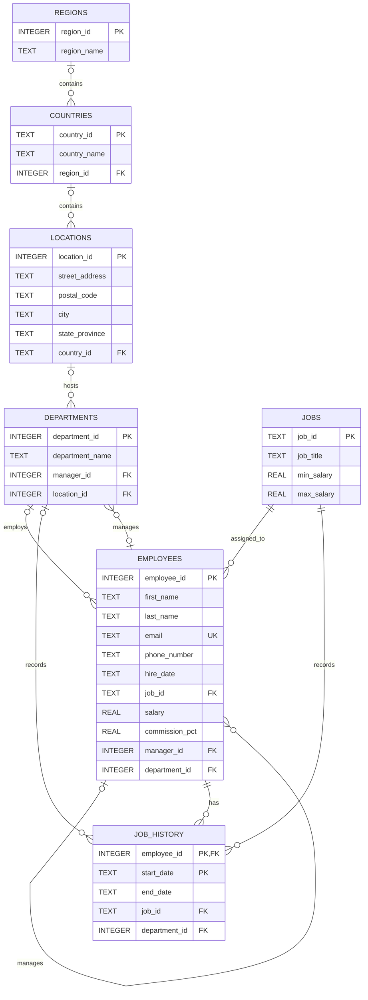

# HR 연습 데이터베이스 스키마

SQL 문제 출제에 사용할 HR 데이터베이스의 테이블, 컬럼, 주요 관계를 정의합니다.
현재 앱에서 사용하는 SQLite에 맞춰 날짜는 ISO-8601 형식의 `TEXT`, 급여와 커미션은 `REAL`로 표현합니다.

## 주요 관계

- `employees.manager_id`는 해당 직원의 직속 관리자인 `employees.employee_id`를 참조합니다.
- `departments.manager_id`는 해당 부서 책임자인 `employees.employee_id`를 참조합니다.
- `job_history`는 `(employee_id, start_date)`를 복합 기본키로 사용합니다.
- `hire_date`, `start_date`, `end_date`는 `YYYY-MM-DD` 형식으로 저장합니다.
- `commission_pct`는 20%를 `0.20`과 같은 비율 값으로 저장합니다.
